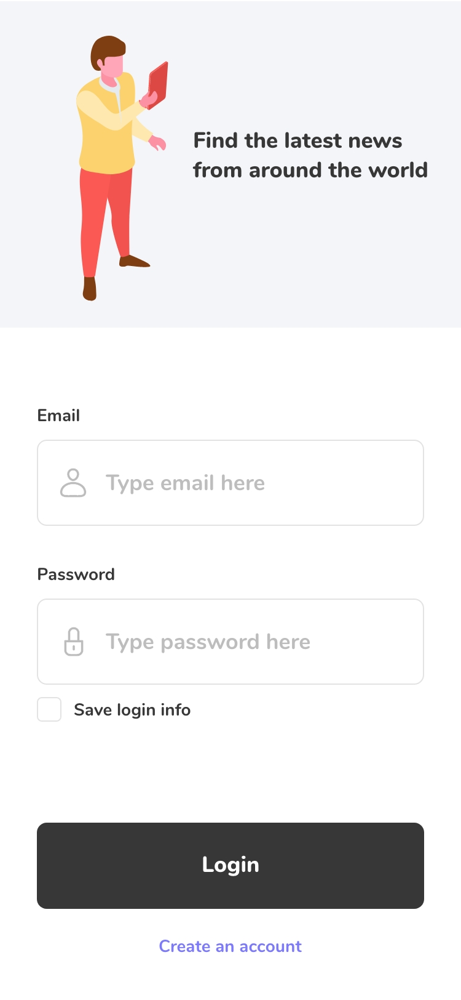
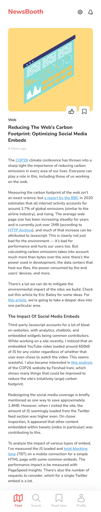

# CPW - CSS : Dossier Juin 2024

> CSS exercise given at HEPL

* * *

**CSS "newsapp"** is an educational project, which will be used for `HTML`/`CSS` courses.

**Note:** the school where the course is given, the [HEPL](http://www.provincedeliege.be/hauteecole) from Liège, Belgium, is a french-speaking school. From this point, the instruction will be in french. Sorry.

* * *

## News App

Vous trouverez dans ce dossier trois page HTML nommée **index.html**, **article.html** et **news.html**.  Vous disposez de tout le matériel nécessaire pour réaliser cet exercice dans les dossiers **img** et **rendus**.

Le rendu final désiré est le suivant : 

- 
- 
- 

### Consignes

* Lier le fichier **reset.css** d'[Eric Meyer](https://meyerweb.com/eric/tools/css/reset/) aux différentes pages HTML.
* En vous fiant aux rendus attendus du fichier Adobe XD, compléter les feuilles de styles.
* Toutes les images à utiliser se trouvent dans le dossier **img**.
* La fonte utilisée est Nunito. Elle est disponible via [Google Fonts](https://fonts.google.com/specimen/Nunito?query=nunito).
* Bon travail et bon amusement&nbsp;!

### Outils

- [css-steptools](https://github.com/tecg-cpw/css-steptools)
- [Comment masquer un élément visuellement ?](https://css-tricks.com/inclusively-hidden/)
- [Comment utiliser adobe XD]( https://youtu.be/S-XJ1K2EuC0 ) ?
- [Background multiples](https://css-tricks.com/css-basics-using-multiple-backgrounds/)
- [Styler un `select`](https://codepen.io/5t3ph/pen/MWyyYNz)
- Si vous avez besoin d'aide pour utiliser Adobe XD, vous pouvez chercher des solutions dans la [documentation officielle](https://helpx.adobe.com/be_fr/xd/tutorials.html) ou me poser des questions sur Slack.

Adaptation et intégration par [François Parmentier](https://github.com/fprms).
